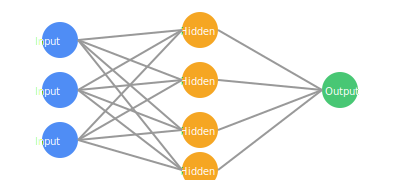

<h1>
   NeuralNet-C
</h1>

[](LICENSE)

This project implements a fully connected feedforward neural network from scratch in pure C. It includes the entire training lifecycle, custom memory management,
dataset parsing, and support for CLI-driven training, validation, and testing — all without external ML or linear algebra libraries.
The architecture closely resembles how modern deep learning frameworks operate internally, but is intentionally low-level and optimized for educational transparency,
systems control, and deployment in constrained environments.

## How to use ?

Clone the repo and cd project_dir

```bash
git clone <project_repo>
cd "project_repo"
```

Make sure the system has zig installed. If not, visit official website and install.
After zig installation, run:

```bash
zig build
```

finally its ready to use.

1. Train network

```bash
./zig-out/bin/test -dataset "dataset_name.csv" "train-test-split ratio" -train "epochs"
```

2. Validate Network

```bash
./zig-out/bin/test -dataset "dataset_name.csv" "train-test-split ratio" -val
```

3. Test the network

```bash
./zig-out/bin/test -dataset "dataset_name.csv" "train-test-split ratio" -test
```

This project is licensed under the MIT License - see the [LICENSE](LICENSE) file for details.
